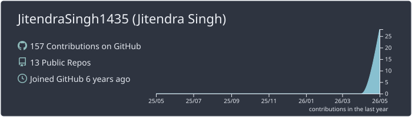
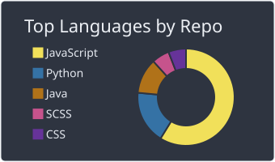
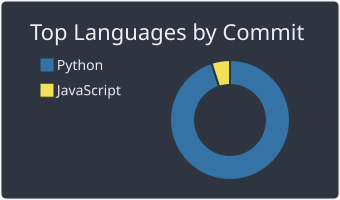
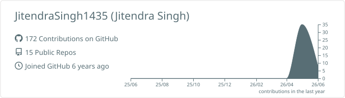
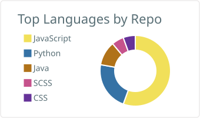
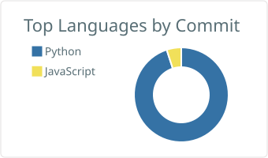

# Hi 👋, I'm Jitendra

<!-- <table align="center">
  <tr>
    <td colspan="2" align="center">
      
    </td>
  </tr>
  <tr>
    <td>
      
    </td>
    <td>
      
    </td>
  </tr>
</table> -->

<!--
<table align="center">
  <tr>
    <td colspan="2" align="center">
      
    </td>
  </tr>
  <tr>
    <td>
      
    </td>
    <td>
      
    </td>
  </tr>
</table>

-->

## About Me

An AI enthusiast focused on Machine Learning, Deep Learning, Large Language Models, Agentic AI, Generative AI, and Retrieval-Augmented Generation (RAG) systems.
I’m passionate about designing intelligent, scalable AI solutions that bridge research and real-world applications.

## 🛠️ The Tech Vault

* 💻 I code in Python, Java, and JavaScript
* 🧠 Deeply into Machine Learning, Deep Learning, and Natural Language Processing (NLP)
* 🤖 Architecting Agentic AI, GenAI, and Large Language Models (LLMs)
* ⚙️ Building with CrewAI, AGNO, Langgraph, Langchain, and MCP servers
* 🔬 Researching Agentic Long Form Context RAG systems and LLM Quantizations & pruning methods
* 🚀 Passionate about designing intelligent, scalable AI solutions that bridge research and real-world applications

---

## 📫 Let's Connect

* 📧 **[jitendrasingh14355@gmail.com](mailto:jitendrasingh14355@gmail.com)**
* 🌐 Always up for impactful projects and collaborations
